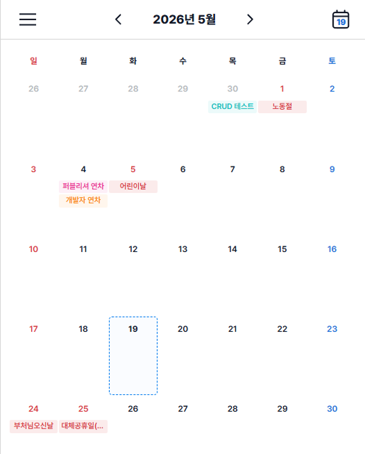

# 📝 Todo List - Frontend

일정을 카테고리별로 관리하고 캘린더로 한눈에 확인할 수 있는 투두리스트 앱입니다.

## 🛠 기술 스택

- Vue 3
- Pinia
- Vue Router
- Vite
- Axios

## 🚀 시작하기

### 사전 준비
- Node.js 20 이상
- Backend 서버 실행 필요 → [todo-list-backend](https://github.com/SJ-J/todo-list)

### 설치 및 실행

```bash
npm install
npm run dev
```

브라우저에서 `http://localhost:5173` 접속

## 📸 화면



## ✨ 주요 기능

- 📅 월별 캘린더로 일정 조회
- ✏️ 일정 추가 / 수정 / 삭제
- 🏷️ 카테고리 관리 (최대 8개)
- ⭐ 우선순위 및 날짜 범위 설정
- ✅ 완료 체크
- 🗓 캘린더·일정 목록에 공휴일 이름 표시

## 👥 팀원

| 이름 | 역할 |
|------|------|
| [@yujin149](https://github.com/yujin149) | 🎨 Design / Publishing / Frontend |
| [@SJ-J](https://github.com/SJ-J) | 🔧 Backend / DB |
